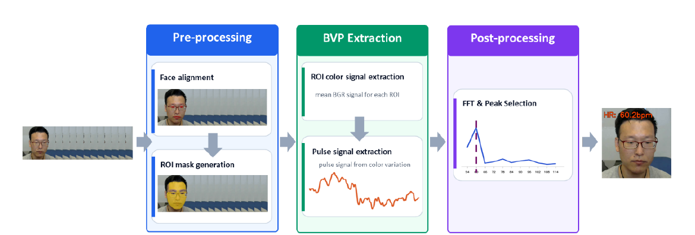

<div align="center">

# HERTZ


### Open-source heart-rate estimation from facial video

HERTZ brings complementary heart-rate estimators into one extensible open-source collection.
TinyHR learns pulse waveforms from facial video, while AdaChrom recovers pulse signals through
an interpretable, training-free chrominance pipeline. The collection follows a modular
organization that supports the incorporation, independent documentation, and comparison of
additional rPPG estimators.

[English](README.md) | [简体中文](README_CN.md)

[HERTZ Project Website](https://seetapsych.github.io/seetapsych-hertz/)

[Introduction](#introduction) · [Estimator collection](#hertz-estimator-collection) · [Installation](#installation) · [Module zoo](#module-zoo) · [Resources](#resources)

[](https://github.com/seetapsych/seetapsych-hertz/blob/main/pyproject.toml)
[](https://github.com/seetapsych/seetapsych-hertz/blob/main/LICENSE)

</div>

## Introduction

HERTZ provides heart-rate estimation modules for the
[SeetaPsych](https://github.com/seetapsych/seetapsych-lib) ecosystem. It includes two
open-source remote photoplethysmography (rPPG) estimators: **TinyHR**, a lightweight
convolutional model that predicts a pulse waveform from facial video, and **AdaChrom**, an
unsupervised signal-processing method based on adaptive skin-region selection, chrominance
projection, and frequency analysis.

## HERTZ Estimator Collection

### TinyHR: lightweight learning-based rPPG

TinyHR is a compact learning-based estimator that predicts an rPPG waveform from facial video and obtains heart rate through spectral post-processing.

#### Overview

The exported ONNX model contains **82,177 parameter elements** and occupies approximately **381 KiB**. TinyHR uses a 160-frame facial-video input window and a default 1.0 s rolling update interval after sufficient valid face frames have been collected.

#### Demonstration

[](https://raw.githubusercontent.com/seetapsych/seetapsych-hertz/main/website/public/media/demo-full.mp4)

The demonstration presents the detected face, predicted rPPG waveform, and heart-rate estimate together.

#### Training Data

TinyHR was trained on subsets of four rPPG datasets. The counts below describe the training data reported in the technical report; they are not the full sizes of the source datasets.

| Dataset | Training subjects | Training videos | Usage |
|---|---:|---:|---|
| VIPL-HR V1 | 85 | 1,883 | Training |
| VIPL-HR V2 | 500 | 2,498 | Training |
| V4V | 103 | 726 | Training |
| MCD-rPPG | 600 | 1,200 | Training; front-facing videos only |
| **Total** | **1,288** | **6,307** | **Four-source training corpus** |

| Training configuration | Setting |
|---|---|
| Batch size | 4 |
| Initial learning rate | 0.005 |
| Learning-rate scheduler | OneCycleLR |
| Input clip | 160 RGB face crops, each resized to 128 × 128 pixels |

Source: [TinyHR technical report](https://raw.githubusercontent.com/seetapsych/seetapsych-hertz/main/website/public/downloads/tinyhr-technical-report.pdf), page 1 (input) and pages 6–7 (training data and configuration).

#### Model Size and Reference Inference Time

| Measurement | Result | Interpretation |
|---|---:|---|
| Exported ONNX parameters | **82,177** | Initializer-element count after export and convolution/normalization fusion; not the pre-export trainable-parameter count |
| ONNX file size | **≈ 381 KiB** | 390,150 bytes; SHA-256 matches the checksum declared in tiny-hr.yml |
| CPU inference time | **80 ms mean** | 100 inference runs on an Intel Core i9-13900KF CPU at 3.00 GHz |
| GPU inference time | **6 ms mean** | 100 inference runs on an NVIDIA H20 GPU in a server environment |
| Input observation duration | **≈ 5.3 s at 30 FPS** | Time to collect 160 valid face frames; the first result also depends on update scheduling and computation |
| Rolling update interval | **1.0 s default** | Timestamp-based update requests; approximately 30 frames per interval at 30 FPS |

The measurements exclude video acquisition, face detection, input-window collection, and update scheduling. They are hardware- and environment-dependent and are separate from accuracy evaluation.

#### Architecture and Inference

[](https://raw.githubusercontent.com/seetapsych/seetapsych-hertz/main/website/public/downloads/tinyhr-flowchart.pdf)

| Stage | Module | Function |
|---:|---|---|
| 01 | Frame Difference Fusion Stem | Concatenates four neighboring-frame RGB differences into 12 channels and extracts features through the difference branch. |
| 02 | Spatial Patch Embedding | A frame-wise 4 × 4 convolution with stride 4 maps 32 × 32 features to a non-overlapping 8 × 8 grid with 32 channels. |
| 03 | Multi-scale Temporal Feature block | Parallel temporal-shift branches, pointwise convolutions, a temporal feed-forward network, and residual fusion integrate temporal features. |
| 04 | Waveform Predictor | Spatial pooling and two pointwise convolutions produce one rPPG sample per input frame. |
| 05 | Signal Processing | Detrending, band-pass filtering, and the dominant Welch PSD peak yield the heart-rate estimate. |

Inference uses a Butterworth band-pass filter with cutoff frequencies of 0.75 and 2.5 Hz (45–150 BPM). Within this search band, the frequency of the largest Welch PSD peak is converted to heart rate:

~~~text
Heart rate (BPM) = 60 × dominant frequency (Hz)
~~~

#### Training Objectives

The technical report defines negative Pearson correlation for temporal waveform agreement, cross-entropy over 45–149 BPM frequency bins, and KL divergence between spectral-peak distributions. Their weights are 0.2, 1.0, and 1.0:

~~~text
L = 0.2 L_time + L_CE + L_KL
~~~

#### Evaluation

Results on the fifth fold of the VIPL-HR dataset:

| Label | MAE ↓ | RMSE ↓ | Pearson ↑ |
|---|---:|---:|---:|
| gt | **5.223** | **8.675** | **0.679** |
| wave | **3.880** | **6.893** | **0.772** |

#### Module Configuration and Usage

Module configuration: [tiny-hr.yml](seetapsych_hertz/modules/tiny-hr.yml)

| Name | Type | Default | Description |
|---|---|---:|---|
| fps | number | 30 | Sampling rate used for waveform buffering and spectral analysis; it must match the effective input frame rate. |
| interval | number | 1 | Timestamp-based interval between update requests, in seconds; distinct from observation duration and computation time. |

~~~bash
seetapsych-webui --files seetapsych_hertz/modules/tiny-hr.yml
~~~

~~~python
from seetapsych_lib.runtime.factory import Factory
from seetapsych_lib.runtime.pipeline import Pipeline

factory = Factory()
factory.load_file_modules("seetapsych_hertz/modules/tiny-hr.yml")
pipeline = Pipeline(factory, ...)
pipeline.add_attributes("face/heart_rate")
~~~

For a complete end-to-end example with visualization, see [examples/camera_heart_rate.py](https://github.com/seetapsych/seetapsych-hertz/blob/main/examples/camera_heart_rate.py).

#### TinyHR Resources

- [Full recorded demonstration](https://raw.githubusercontent.com/seetapsych/seetapsych-hertz/main/website/public/media/demo-full.mp4)
- [TinyHR technical report](https://raw.githubusercontent.com/seetapsych/seetapsych-hertz/main/website/public/downloads/tinyhr-technical-report.pdf)
- [Architecture diagram](https://raw.githubusercontent.com/seetapsych/seetapsych-hertz/main/website/public/downloads/tinyhr-flowchart.pdf)

### AdaChrom: unsupervised chrominance-based rPPG

AdaChrom is an unsupervised remote photoplethysmography method for heart-rate estimation from
facial videos. Instead of relying on labeled training data, AdaChrom estimates pulse-related
blood volume pulse (BVP) signals from subtle temporal color variations in facial skin regions,
providing an interpretable solution for contactless heart-rate estimation. Given a facial video
sequence, AdaChrom follows a three-stage
pipeline. In the pre-processing stage, face alignment is performed and ROI masks are generated.
In the BVP extraction stage, mean BGR color signals are extracted from valid facial regions over
a sliding temporal window, and the BVP signal is recovered from these temporal color signals. In
the post-processing stage, heart rate is estimated from the recovered BVP signal through
frequency-domain analysis and peak selection.



*AdaChrom signal-processing pipeline.*

#### A. Pre-processing

In the pre-processing stage, AdaChrom establishes reliable spatial support for ROI-based signal
extraction. Specifically, facial landmarks are aligned to reduce motion-induced ROI shifts, while
valid facial skin regions are defined through ROI mask generation for subsequent BVP extraction.

##### i) Face Alignment

Face Alignment provides the geometric basis for all subsequent ROI operations. The aligned
landmarks also provide a validity check for each frame, and frames with missing, zero, or
non-finite landmark coordinates are excluded from the current estimation window. The details of
face alignment can be found in SeetaPsych Face Hub.

##### ii) ROI Mask Generation

After alignment, landmarks-defined polygon regions are used to construct facial ROI masks that
isolate skin-dominant facial areas. A skin-color constraint is further applied in YCrCb color
space. The final ROI mask is obtained by intersecting the geometric face mask with the detected
skin mask. For each valid ROI, the algorithm records both the mean BGR value and the number of
effective pixels, so empty or unreliable ROIs can be rejected before signal estimation. Four ROI
strategies are supported in this implementation.

**Legacy YCrCb Skin ROI (AdaChrom-v1):** The legacy skin ROI first constructs a full-face mask
from the facial landmarks and then applies a fixed YCrCb skin-color rule to identify skin pixels
within the face region.

**Fixed Forehead-seeded Skin ROI (AdaChrom-v2):** The fixed forehead strategy uses a predefined
landmark-based forehead region as the seed area for skin-color modeling. A two-dimensional
Gaussian model is fitted in the Cr/Cb color space using the seed pixels, and pixels within the
face region are retained when their color distribution is sufficiently close to the learned
forehead skin model.

**Adaptive Forehead-seeded Skin ROI (AdaChrom-v3):** The adaptive forehead strategy extends the
seed region around the forehead before estimating the Cr/Cb skin-color model. Compared with the
fixed forehead seed, this strategy is designed to include more reliable forehead skin pixels and
improve robustness when the fixed seed area is too small or partially affected by local landmark
variation.

**Connected-component-filtered Skin ROI (AdaChrom-v4):** In addition to the adaptive forehead
strategy, the connected-component strategy further filters the candidate skin regions according
to spatial connectivity. Isolated false-positive regions are removed, while larger connected
components that are spatially consistent with the face skin area are preserved for subsequent
BGR signal extraction.

#### B. BVP Extraction

In the BVP extraction stage, AdaChrom converts spatial color observations from facial ROIs into
temporal color traces and recovers the pulse-related BVP signal from these traces. This stage
aggregates valid ROI measurements over a sliding temporal window, providing the signal
representation used for subsequent heart-rate estimation.

##### i) ROI Color Signal Extraction

For every valid frame and ROI, the algorithm computes the spatial mean of the BGR pixel values
inside the ROI mask:

$$
c_t = [\overline{B_t}, \overline{G_t}, \overline{R_t}]
$$

This produces a temporal color trace for each ROI. Because remote photoplethysmography relies on
subtle skin-color variations caused by blood volume changes, spatial averaging is used to
suppress pixel-level noise and preserve the dominant temporal variation.

Before pulse extraction, the irregularly sampled color observations are regularized onto an
evenly spaced time grid using the frame timestamps. The signal is then smoothed to reduce
high-frequency noise and normalized by each channel's temporal mean to reduce illumination-scale
effects.

##### ii) Pulse Signal Extraction

The core BVP extraction model follows a CHROM-style chrominance projection. The normalized
RGB traces are transformed into two chrominance components:

$$
X = 3R - 2G
$$

$$
Y = 1.5R + G - 1.5B
$$

The pulse signal is then computed by balancing the two components according to their temporal
standard deviations:

$$
\alpha = \frac{std(X)}{std(Y)}
$$

$$
s(t) = X - \alpha Y
$$

This projection emphasizes color changes associated with blood volume pulse while suppressing
illumination variation and motion-related intensity changes. The projected BVP signal is then
mean-centered, scaled, and smoothed before spectral analysis.

#### C. Post-processing

The post-processing stage converts the extracted BVP signal into the final heart-rate estimate
through FFT-based spectral analysis and peak selection. A Hamming window is applied before the
real-valued FFT to reduce spectral leakage. The magnitude spectrum is searched within the
estimator's valid heart-rate range, approximately 50-120 bpm. The dominant spectral peak is
selected as the heart-rate frequency and converted to beats per minute.

$$
f_{peak} = \underset{f}{\arg\max}\, |FFT(s(t))|
$$

$$
HR = 60 f_{peak}
$$

#### Evaluation

Results for AdaChrom-v4 on the fifth fold of the VIPL-HR dataset:

| Label | MAE ↓ | RMSE ↓ | Pearson ↑ |
|---|---:|---:|---:|
| gt | **8.60** | **13.00** | **0.42** |
| wave | **6.63** | **9.84** | **0.47** |

## Installation

This project is included in the default SeetaPsych configuration. Download its modules
with:

```bash
seetapsych-manager download
```

For the complete framework workflow, see
[SeetaPsych](https://github.com/seetapsych/seetapsych-lib).

## Module Zoo

| Module | Description | Input modes |
|---|---|---|
| [AdaChrom](https://github.com/seetapsych/seetapsych-hertz/blob/main/seetapsych_hertz/modules/ada-chrom.yml) | Chrominance-based rPPG on adaptive skin ROIs, without a learned pulse estimator | Video stream · video file |
| [TinyHR](https://github.com/seetapsych/seetapsych-hertz/blob/main/seetapsych_hertz/modules/tiny-hr.yml) | Convolutional rPPG waveform estimation with Welch PSD-based heart-rate post-processing | Video stream · video file |

### AdaChrom

> Model-free rPPG heart rate estimation using adaptive chrominance analysis on skin ROI.

Module config: [ada-chrom.yml](https://github.com/seetapsych/seetapsych-hertz/blob/main/seetapsych_hertz/modules/ada-chrom.yml)

| Package | Provides | Requires |
|---|---|---|
| HeartRate-AdaChrom | `face/heart_rate` | `face/dense_landmarks` |

**Description**

Adaptive chrominance rPPG heart rate estimator from adaptive forehead ROI, no neural model required.

**Usage Notes**

- Supports both video streams and video files.
- For video stream mode, best results are achieved at 30 FPS or higher, which requires optimized processing logic and better hardware (with GPU).
- For stable analysis results, it is recommended to use video files with a stable frame rate of 30 FPS or higher.

**Parameters**

| Name | Type | Default | Description & Tuning |
|---|---|---|---|
| `window_samples` | integer | `300` | Sliding window frame count for HR estimation. Larger values reduce noise but increase latency; adjust based on real-time demand. |
| `roi_regions` | `selection[]` | `["skin_b_adaptive_forehead"]` | List of regions to use for HR estimation. Defaults to ["skin_b_adaptive_forehead"]. Multiple selectors are evaluated independently, with valid results merged into the fused `hr_bpm` and the per-region `roi_hr_bpm` map. |

**Models**

*(None)*

**Output Attributes**
- `face/heart_rate` — [spec](https://github.com/seetapsych/seetapsych-attributes#faceheart_rate).

The per-region results requested via `roi_regions` are returned inside `roi_hr_bpm`: each key corresponds to one selected ROI and the value is that region's heart rate in BPM for the current window.

## Resources

- [TinyHR technical report](https://raw.githubusercontent.com/seetapsych/seetapsych-hertz/main/website/public/downloads/tinyhr-technical-report.pdf)
- [TinyHR architecture diagram](https://raw.githubusercontent.com/seetapsych/seetapsych-hertz/main/website/public/downloads/tinyhr-flowchart.pdf)
- [HERTZ Project Website](https://seetapsych.github.io/seetapsych-hertz/)
- [Interactive project page source](https://github.com/seetapsych/seetapsych-hertz/tree/main/website)
- Hugging Face model distribution and interactive demos are planned.

## License

This project is released under the [BSD 3-Clause License](https://github.com/seetapsych/seetapsych-hertz/blob/main/LICENSE).

## Affiliations

<p align="center">
  <a href="https://scholar.google.com/citations?user=HRBTJYYAAAAJ" title="Southeast University"></a>
  &nbsp;&nbsp;&nbsp;&nbsp;&nbsp;&nbsp;
  <a href="https://vipl.ict.ac.cn/en/index.html" title="Institute of Computing Technology, Chinese Academy of Sciences"></a>
</p>
