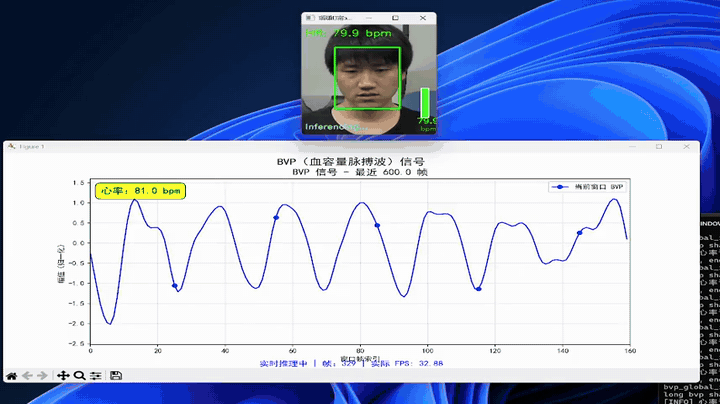
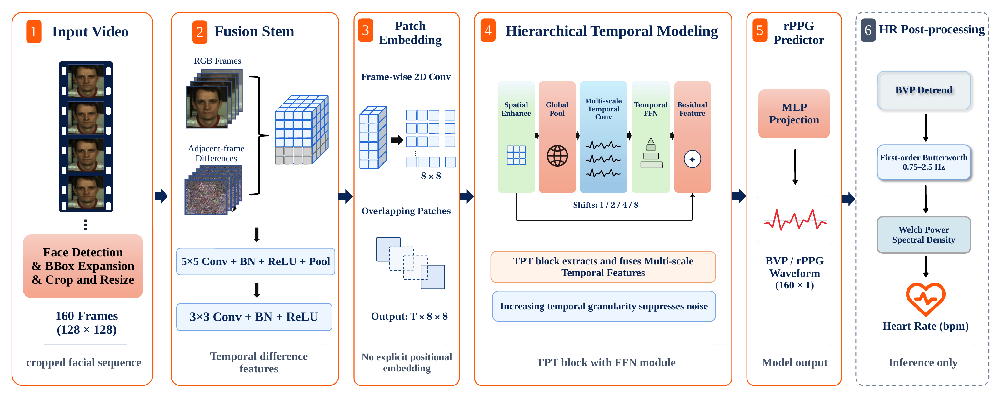

<div align="center">

# SeetaPsych Hertz / TinyHR

## See the pulse. Through video.

A lightweight model that recovers pulse waveforms and estimates heart rate from
facial video.

[**Watch demo**](website/public/media/demo-full.mp4) ·
[**Technical report**](website/public/downloads/tinyhr-technical-report.pdf) ·
[**Architecture PDF**](website/public/downloads/tinyhr-flowchart.pdf)

[](website/public/media/demo-full.mp4)

*Animated 12-second preview · click it to watch the full video*

</div>

## See it in action

### From facial video to a pulse waveform

The recorded TinyHR pipeline presents facial video, a predicted rPPG waveform,
and heart-rate estimates together. The recording illustrates the pipeline;
accuracy is reported separately in the evaluation below.

## From video to pulse

### How TinyHR works

Remote photoplethysmography (rPPG) estimates pulse-related signals from subtle
changes in light reflected by facial skin. TinyHR processes a clip of 160 RGB
facial frames at 128 × 128 pixels. Its lightweight convolutional pipeline
emphasizes differences between neighboring frames, builds compact spatial
features, and combines temporal information at multiple scales. The network
predicts one rPPG waveform sample per video frame. Heart rate is then calculated
from the predicted waveform using filtering and spectral analysis.

[](website/public/downloads/tinyhr-flowchart.pdf)

*Click the diagram to open the architecture PDF.*

| Stage | Module | Function |
|---:|---|---|
| 01 | Frame Difference Fusion Stem | Converts four neighboring-frame difference maps into compact spatial features. |
| 02 | Spatial Patch Embedding | Reduces each feature map from 32 × 32 to 8 × 8 while preserving time. |
| 03 | Multi-scale Temporal Feature Block | Combines temporal information at different offsets with residual feature fusion. |
| 04 | Waveform Predictor | Produces one rPPG waveform value for every input frame. |

### From waveform to heart rate

During inference, a second-order Butterworth band-pass filter retains frequencies
from 0.75 to 2.5 Hz. Welch's method estimates the power spectral density of the
filtered waveform, and the dominant frequency is converted to beats per minute.

```text
Heart rate (BPM) = 60 × dominant frequency (Hz)
```

Training combines waveform agreement, frequency-domain classification, and
heart-rate distribution objectives:

```text
L = 0.2 L_time + L_CE + L_KL
```

## Evaluation

### Reported performance

| Mean absolute error | Dataset | Test split | Input |
|---:|---|---|---|
| **3.88 BPM** | VIPL-HR V1 | 22 subjects · 485 videos | 160 frames · 128 × 128 |

This is author-reported performance on the held-out test set described in the
[TinyHR technical report](website/public/downloads/tinyhr-technical-report.pdf).
It is not a per-video error bound.

## Explore the project

| Resource | Description |
|---|---|
| [Source code](#usage) | Setup and usage instructions |
| [Full demo](website/public/media/demo-full.mp4) | Recorded TinyHR pipeline |
| [Technical report](website/public/downloads/tinyhr-technical-report.pdf) | Architecture, training objectives, and evaluation |
| [Architecture diagram](website/public/downloads/tinyhr-flowchart.pdf) | Full pipeline schematic in PDF format |
| Hugging Face | Model distribution and interactive demos are planned |

## Usage

This project is already included in the seetapsych-lib default configuration. Download and use it via `seetapsych-manager download`.

For usage, refer to [SeetaPsych](https://github.com/seetapsych/seetapsych-lib).

You can additionally add this algorithm module using the following methods.

Heart rate estimation requires processing video or real-time video streams to extract heart rate information.

### WebUI

Run `seetapsych-webui` with the `--files` argument to use it.

```
seetapsych-webui --files seetapsych_hertz/modules/seeta.yml
```

### Programmatic Usage

Add the following code in your program to use this algorithm module.

```python
from seetapsych_lib.runtime.factory import Factory
from seetapsych_lib.runtime.pipeline import Pipeline

factory = Factory()
factory.load_file_modules("seetapsych_hertz/modules/seeta.yml")

pipeline = Pipeline(factory, ...)

pipeline.add_attributes("face/heart_rate")
```

### Module Catalog

| Module YAML Path | Package Name |
|---|---|
| `seetapsych_hertz/modules/ada-chrom.yml` | HeartRate-AdaChrom |
| `seetapsych_hertz/modules/seeta.yml` | HeartRate-Seeta |
| `seetapsych_hertz/modules/tiny-hr.yml` | HeartRate-TinyHR |

### AdaChrom

> Model-free rPPG heart rate estimation using adaptive chrominance analysis on skin ROI.

Module config: [ada-chrom.yml](seetapsych_hertz/modules/ada-chrom.yml)

| Package | Provides | Requires |
|---|---|---|
| HeartRate-AdaChrom | `face/heart_rate` | `face/dense_landmarks` |

**Description**

Adaptive chrominance rPPG heart rate estimator. Accepts multiple ROI selectors; the default forehead-only adaptive skin mask (`skin_b_adaptive_forehead`) matches the original delivery configuration, while the preset group `all` runs every available region.

**Usage Notes**

- Supports both video streams and video files.
- For video stream mode, best results are achieved at 30 FPS or higher, which requires optimized processing logic and better hardware (with GPU).
- For stable analysis results, it is recommended to use video files with a stable frame rate of 30 FPS or higher.

**Parameters**

| Name | Type | Default | Description & Tuning |
|---|---|---|---|
| `window_samples` | integer | `300` | Sliding window frame count for HR estimation. Larger values reduce noise but increase latency; adjust based on real-time demand. |
| `roi_regions` | `selection[]` | `["skin_b_adaptive_forehead"]` | ROI selectors to estimate heart rate on. Multiple selectors are evaluated independently, with valid results merged into the fused `hr_bpm` and the per-region `roi_hr_bpm` map. |

**Models**

*(None)*

**Output Attributes**
- `face/heart_rate` — [spec](https://github.com/seetapsych/seetapsych-attributes#faceheart_rate).

The per-region results requested via `roi_regions` are returned inside `roi_hr_bpm`: each key corresponds to one selected ROI and the value is that region's heart rate in BPM for the current window.

### TinyHR

> Lightweight neural network for fast heart rate estimation directly from face video frames.

Module config: [tiny-hr.yml](seetapsych_hertz/modules/tiny-hr.yml)

| Package | Provides | Requires |
|---|---|---|
| HeartRate-TinyHR | `face/heart_rate` | `face/detection` |

**Description**

Fast RhythmFormer heart rate estimator using buffered face crops + Welch spectral analysis.

**Usage Notes**

- Supports both video streams and video files.
- For video stream processing, frame rates close to 30 or 25 FPS yield the best results.
- For stable analysis results, it is recommended to use video files with a frame rate of 30 FPS or 25 FPS.

**Parameters**

| Name | Type | Default | Description & Tuning |
|---|---|---|---|
| `fps` | number | `30` | Expected camera/video FPS used for spectral analysis windowing. Mismatch with actual source FPS degrades HR accuracy. |
| `interval` | number | `1` | Seconds between consecutive HR estimates. Smaller intervals yield more updates with higher jitter; larger intervals are smoother but slower. |

**Models**

| Model | Recommended |
|---|---|
| `seeta-hertz-tinyhr.onnx` | ✓ |

**Output Attributes**
- `face/heart_rate` — [spec](https://github.com/seetapsych/seetapsych-attributes#faceheart_rate).
